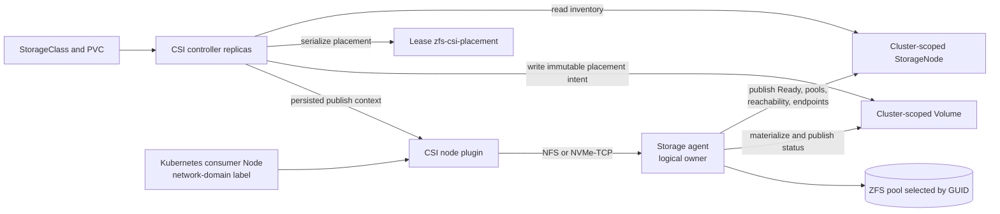

# Multi-Storage-Agent Topology and Placement

!!! warning "Production readiness"

    Phases 1-5 implement the API, inventory, placement, reservation, and persisted-endpoint
    contracts described here. The Helm chart configures multiple logical owners and isolated
    endpoint sets, but this release permits only one NFS-exportable pool root per owner. Do not
    configure one owner with multiple authoritative pools while a chart NFS StorageClass is
    enabled.

This explanation describes why zfs-csi separates storage ownership from Kubernetes node
identity, how network topology controls placement, and how immutable placement differs from
refreshable owner endpoint status.

## Distinct Identities

Several objects called "nodes" have different jobs:

| Term | Meaning |
|---|---|
| Consumer node | Kubernetes `Node` where an application pod runs. |
| Logical storage owner | Cluster-scoped `StorageNode.metadata.name`; currently matched to the storage agent's Kubernetes `spec.nodeName`/`NODE_NAME`, while durable authority comes from pool GUIDs. |
| Storage agent | Privileged zfs-csi process that discovers pools and reconciles storage owned by one logical owner. |
| ZFS pool | Backend selected by immutable decimal pool GUID, not mutable pool name. |
| Network domain | Stable reachability label shared by consumer nodes that can use an owner's published endpoints. |
| Controller replica | CSI control-plane process that reads inventory, selects placement, and writes intent resources. |
| CSI node plugin | DaemonSet process on a consumer node that validates persisted identity and mounts NFS or attaches NVMe-TCP. |

A logical owner currently uses the backing Kubernetes Node name as its object name and agent
selector. Its authority is pool-backed because Kubernetes node UID is not durable enough for
storage safety. A host can be reinstalled or a pod can move while the same pool remains the
authoritative data owner. Conversely, a replacement pool on the same host is not the same
storage. `StorageNode.spec.authoritativePoolGUIDs` therefore identifies the exact pool set the
owner may mutate.

The owner name and authoritative GUID set are immutable. Renaming an owner means migration,
not editing a label. A storage agent fails closed when its discovered `ONLINE` GUID set differs
from the declared set; a non-owner must never create, export, or destroy data.

## Components and Data Flow



`StorageNode`, `Volume`, `Snapshot`, and `VolumeImport` are cluster-scoped. Their names and
specifications carry intent, while status fields are split by responsibility:

- the storage agent owns `StorageNode.status`, backend materialization state, protocol
  endpoints, and snapshot state for its logical owner;
- the controller reads `StorageNode` inventory, writes `Volume`/`Snapshot` intent, and owns
  controller-side publication records such as mapped initiators;
- the `VolumeImport` controller writes import status and materializes an imported `Volume`;
- the CSI node plugin consumes current endpoint and identity data persisted in `Volume.status`;
  it does not choose a storage owner.

These ownership boundaries are enforced by RBAC. Controllers have read-only access to
`StorageNode`; storage agents may read their object and patch `StorageNode/status`. Creating or
changing authoritative `StorageNode` intent is an administrator operation.

## StorageNode Inventory Contract

One `StorageNode` represents one logical owner. Its specification contains:

- `authoritativePoolGUIDs`: canonical, unique, non-zero decimal pool GUID strings; immutable;
- `enabled`: placement switch, default `true`;
- `networkDomain`: stable Kubernetes label value used for reachability; immutable.

The storage agent periodically publishes:

- `Ready`, `observedGeneration`, and `lastObservedTime`;
- `reachableFrom` network domains;
- protocol endpoints for `nfs` and `nvme-tcp`;
- discovered pool name, GUID, free bytes, sample time, and readiness.

Inventory is eligible only when the Kubernetes `Node` running the agent is `Ready`, the owner
is enabled, its `Ready=True` condition and observed generation are current, its last observation
is fresh, both endpoint records are valid, pool discovery succeeded, and the exact declared
GUID set is present and `ONLINE`. The current publisher refreshes every 30 seconds. Placement
accepts observations no more than 90 seconds old and tolerates at most 30 seconds of future
clock skew. Missing, stale, or malformed inventory is excluded rather than guessed.

The storage agent reports exact `Ready` reasons useful during diagnosis:
`ObservationSucceeded`, `NodeNotFound`, `NodeReadFailed`, `InvalidAuthoritativeIdentity`,
`Disabled`, `NodeNotReady`, `EndpointInvalid`, `CapacityAccountingFailed`, `DiscoveryFailed`,
and `PoolIdentityMismatch`.

`reachableFrom` states which consumer network domains can reach the owner's NFS and NVMe-TCP
endpoints. It is not a list of addresses. Endpoint hosts are published separately and may be an
IPv4 address, IPv6 address, or DNS name.

## Consumer Topology and Reachability

The CSI topology key is:

```text
topology.zfs.csi.randomvariable.co.uk/network-domain
```

Each consumer Kubernetes node must carry a stable, bounded Kubernetes label value for this
key, for example `storage-east` or `storage-v6`. Use organizational reachability names, not IP
addresses, CIDRs, portal strings, or storage-owner names. `NodeGetInfo` returns this segment from
the node plugin's `--network-domain` value (or the `NETWORK_DOMAIN` environment default).

```bash
kubectl label node worker-a \
  topology.zfs.csi.randomvariable.co.uk/network-domain=storage-east
```

`CreateVolume` applies CSI `AccessibilityRequirements` as follows:

1. Every `requisite` domain is a mandatory eligibility boundary.
2. `preferred` domains rank only candidates already allowed by `requisite`; preference never
   widens eligibility.
3. Empty requirements allow any fresh reachable domain; deterministic ranking selects one.
4. No reachable candidate returns CSI `ResourceExhausted`.

The chosen domain is persisted in `Volume.spec.networkDomain`, and `CreateVolumeResponse`
returns that same domain in `AccessibleTopology`. Together with the matching topology segment
from `NodeGetInfo`, this gives external-provisioner the scheduler-facing topology contract.
The Helm chart supports multiple owners, while each node-plugin pod currently advertises one
configured network domain. Distinct consumer domains are supported when that domain is included
in the selected owner's `reachableFrom` set.

The approved rollout contract will use this same topology key as the default Kubernetes Node
label key. In node-label mode, the node plugin will use its downward-API Node name for exactly one
startup Node GET, with RBAC limited to `get nodes`; it will not list, watch, cache, or start a
manager for Node-domain lookup. Missing Node data or an invalid/absent label will fail startup
closed. Legacy static `--network-domain` mode remains available during migration.

Each owner's `reachableFrom` value is an operator-configurable set and must contain that owner's
`networkDomain`. The chart renders `networkDomain` into `StorageNode.spec` and passes the
configured `reachableFrom` set to each storage agent, which publishes that set in status.

Storage-owner identity is deliberately absent from consumer topology. A pod needs network
reachability to its volume, not affinity to the host that owns the pool.

## Placement and Capacity

For a new volume, the controller:

1. validates capabilities, content source, and CSI accessibility requirements;
2. reads fresh eligible `StorageNode` inventory;
3. applies a requested pool selector, or source owner/pool/domain affinity for a clone or
   restore;
4. computes effective free space for each reachable pool;
5. acquires the namespaced `zfs-csi-placement` Kubernetes `Lease`;
6. repeats selection while holding the lease and creates the `Volume` intent;
7. persists immutable `spec.ownerNode`, `spec.poolGUID`, and `spec.networkDomain`;
8. releases the lease, then waits for the owning storage agent to materialize the backend and
   publish protocol status.

Candidate ranking is deterministic: preferred-domain rank, then effective remaining capacity,
then logical owner and pool GUID. A same-name retry reads the existing `Volume` and keeps its
placement; it does not drift to a newly more attractive owner.

The lease serializes placement across controller replicas. A controller crash can stall new
placement for no more than the lease expiry window. Slow KMS key generation occurs before lease
acquisition so it does not hold the cluster-wide placement lock. The chart currently runs one
controller replica, but the lease contract makes placement safe when a future chart enables
more replicas.

### Reservation Accounting

Placement subtracts reservations for non-terminal volumes from sampled free bytes. A deleting
volume continues to reserve capacity until its status reaches `Destroyed`; deletion intent is
not proof that space is free.

The publisher avoids comparing timestamps from different hosts. Before sampling pool capacity,
it captures the set of already materialized volumes. After the sample succeeds, it stamps only
those captured volumes with `status.capacityAccountedAt` equal to that pool sample's
`capacityObservedAt`. Placement subtracts a reservation unless those markers are equal. A
volume materialized during sampling therefore remains reserved until a later observation proves
that the backend sample includes it.

This observation-marker design prevents double subtraction without unsafe cross-node wall-clock
ordering.

## Persisted Placement and Endpoint Status

Immutable placement and owner-qualified protocol identity are stored on the `Volume`, not
reconstructed from current inventory during each attach:

- filesystem: `status.nfsServer` and authoritative `status.exportPath`;
- block: `status.portalHost`, `status.portalPort`, owner-qualified `status.targetNQN`, and
  owner-qualified `status.deviceGUID`.

For NFS, CSI mount source formatting brackets IPv6 hosts:

```text
192.0.2.44:/tank/csi/filesystem/example
[2001:db8:44::10]:/tank/csi/filesystem/example
```

This is not export policy syntax. The export CIDRs configured on a StorageClass control which
clients may mount, while the CSI mount source combines one server address with an export path.
(Exports are served by the in-process nfsd responder, not the `sharenfs` property — see
[Transport](transport.md).)

NVMe-TCP portals include host and port; IPv6 is bracketed by normal host-port formatting:

```text
192.0.2.45:4420
[2001:db8:45::10]:4420
```

Owner-qualified NQN and DeviceGUID derivation prevents two logical owners with similar local
dataset identities from colliding at consumers.

The owning storage agent may refresh `status.nfsServer`, `status.portalHost`,
`status.portalPort`, and applicable export or transport identity fields when its valid endpoint
configuration changes. `ControllerPublishVolume` and later stage operations read current
persisted status: filesystem volumes return current NFS publish context, while block volumes wait
for owner authorization and return current portal, NQN, and DeviceGUID. `NodeStageVolume`
validates that context before mounting or attaching.

An endpoint refresh does not migrate an active NFS mount or NVMe attachment. Existing sessions
remain on the endpoint they already use until normal unpublish, unstage, and restage. For NVMe,
the identity persisted in node-local staging state remains available to `NodeUnstageVolume` even
after owner status changes. Immutable `spec.ownerNode`, `spec.poolGUID`, and
`spec.networkDomain` never change, and no transparent owner/domain migration or failover exists.

## Source Affinity

Clones and snapshot restores remain on the source owner and pool. The selected network domain
must also remain reachable under the request's topology constraints. This preserves ZFS-local
clone/restore semantics and prevents a request from becoming an implicit cross-owner data copy.

Imported volumes follow the same owner, pool GUID, domain, and persisted-endpoint safety model.
Their `Retain` deletion policy remains authoritative: de-adoption removes transport state but
does not destroy backend data. Phase 1 does not allow snapshots, clones, expansion, or
`VolumeAttributesClass` changes for imported volumes.

## Current and Future Scope

Implemented or gated in Phases 1-5:

- retained imports;
- logical-owner and pool-GUID inventory;
- topology-aware, deterministic placement under a cluster-wide lease;
- observation-marker capacity reservations;
- persisted NFS and NVMe-TCP endpoint identity;
- owner checks and fail-closed finalizer behavior.

Operational limitations are direct:

- each owner runs one `Deployment` with `Recreate`;
- each enabled owner may expose NFS from only one authoritative pool; the chart rejects a
  multi-pool owner when any chart NFS StorageClass is enabled because owner-scoped NFS disablement
  is not configurable;
- consumer nodes advertise one network domain;
- `enableVolumeImports` must remain disabled unless every owner agent is retain-aware.

The NFS limit is chart/runtime scope, not an API restriction:
`StorageNode.spec.authoritativePoolGUIDs` intentionally remains plural (up to 32), and multi-pool
owners remain valid for NVMe block provisioning. Current NFSv4 export management has one MemTable
root and one host nfsd `fsid=0` namespace, while each owner Deployment mounts one
`poolMountRoot`. Safe multi-pool NFS therefore needs a configured, host-global, non-overlay
ZFS-backed pseudoroot containing mounts for all exportable pools. Future work should extend that
single host namespace, not run per-pool nfsd namespaces.

Intentionally out of scope:

- kTLS;
- external NVMe initiator authentication;
- Samba/SMB;
- automatic endpoint failover or volume migration;
- `StorageCapacityScoring`-specific optimization.

## Further Reading

- [Operate Storage Topology Safely](../how-to/operate-storage-topology.md) (how-to)
- [Storage Model](storage-model.md) (explanation)
- [Kubernetes API Surface](../reference/kubernetes-api.md) (reference)
- [Command-Line Reference](../reference/command-line.md) (reference)

---

**Last Updated:** July 2026
